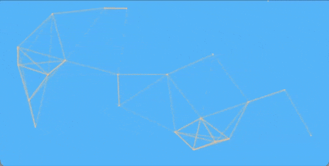

# Connected Particles P5.js

A lightweight and customizable p5.js library for creating an animated background of particles that connect to nearby particles, forming an interactive visual network. The simulation uses a spatial grid for efficient neighbor searching, making it performant even with a large number of particles.

## Demo / Example



See the `example/browser` directory for a working demonstration:
* `index.html`: Basic HTML setup to host the p5.js sketch.
* `sketch.js`: Example p5.js sketch demonstrating how to initialize and use `ParticleSim`.

To run the example, simply open `example/index.html` in your web browser. Ensure that the `connected-particles-p5.esm.min.js` file (or the source `ParticleSim.js` and `Particle.js` if not using a bundled version) is accessible from `sketch.js`. Due to CORS errors when importing the javascript file, you may have to use serve (npm install -g serve) if running locally.

## Configuration Options

When creating a `new ParticleSim(p5, width, height, options)`, you can pass an `options` object with the following properties:

| Property                | Type    | Default Value                     | Description                                                                                                |
| ----------------------- | ------- | --------------------------------- | ---------------------------------------------------------------------------------------------------------- |
| `backgroundColor`       | String  | `'#FFFFFF'` (white)               | Background color of the canvas (CSS color string).                                                         |
| `particleColor`         | String  | `'#000000'` (black)               | Color of the particles (CSS color string).                                                                 |
| `connectColor`          | String  | `'#000000'` (black)               | Color of the lines connecting particles (CSS color string).                                                |
| `maxParticles`          | Number  | `300`                             | The maximum number of particles that can be generated.                                                     |
| `particlesPerPixel`     | Number  | `0.00018`                         | Density of particles relative to canvas area (total particles will be `width * height * particlesPerPixel`).                         |
| `particleDiameter`      | Number  | `5`                               | Diameter of each particle in pixels. Set to `0` or less to hide particles (connections will still show). |
| `maxParticleVel`        | Number  | `1`                               | Maximum velocity for particles.                                                                            |
| `connectLineWidth`      | Number  | `2`                               | Width of the lines connecting particles in pixels.                                                         |
| `connectMaxRadius`      | Number  | `120`                             | The maximum distance at which particles will connect to each other.          |
| `doScaleConnectWeight`  | Boolean | `true`                            | If true, connection lines will be more transparent (alpha) the further apart the particles are.            |
| `doRegenOnWindowResize` | Boolean | `false`                           | If true, particles will be regenerated when the window (and canvas) is resized.                            |

Okay, I'll update the "Installation / Usage" section of the README.md to reflect that connected-particles-p5 is an npm package.

Here's the revised section:

Markdown

## Installation / Usage

1.  **Include p5.js:** Make sure you have p5.js included in your project. You can use a CDN, install it via npm/yarn, or use a local copy.
    ```html
    <script src="[https://cdnjs.cloudflare.com/ajax/libs/p5.js/1.9.0/p5.min.js](https://cdnjs.cloudflare.com/ajax/libs/p5.js/1.9.0/p5.min.js)"></script>
    ```
    Or if you're using a module bundler:
    ```bash
    npm install p5
    # or
    yarn add p5
    ```
    And then import it in your project:
    ```javascript
    import p5 from 'p5';
    ```

2.  **Install `connected-particles-p5`:**
    Install the package using npm or yarn:
    ```bash
    npm install connected-particles-p5
    # or
    yarn add connected-particles-p5
    ```

3.  **Import and Use in your p5.js Sketch:**

    ```javascript
    // Import p5 if you installed it via npm/yarn and are using a bundler
    // import p5 from 'p5'; // Or however you normally instantiate p5

    // Import ParticleSim from the npm package
    import ParticleSim from 'connected-particles-p5';
    ```

4.  **HTML Setup (if not using a full bundler setup for HTML):**

    ```html
    <!DOCTYPE html>
    <html lang="en">
    <head>
        <meta charset="UTF-8">
        <meta name="viewport" content="width=device-width, initial-scale=1.0">
        <title>Connected Particles</title>
        <script src="[https://cdnjs.cloudflare.com/ajax/libs/p5.js/1.9.0/p5.min.js](https://cdnjs.cloudflare.com/ajax/libs/p5.js/1.9.0/p5.min.js)"></script>
    </head>
    <body>
        <main></main>
        <script type="module" src="path/to/your/bundled/sketch.js"></script>
    </body>
    </html>
    ```

**Alternative (Using Source Files for Development/Direct Use):**

If you are not using npm or prefer to use the source files directly:
1.  Download or clone the `ParticleSim.js` and `Particle.js` files.
2.  Place them in your project directory (e.g., in a `lib` folder).
3.  Ensure the import path in `ParticleSim.js` for `Particle.js` is correct (`import Particle from './Particle.js';` assumes they are in the same directory).
4.  Import `ParticleSim.js` in your sketch using a relative path.

### `ParticleSim` Class

#### `constructor(p5, width, height, options)`
* `p5`: The p5.js instance.
* `width`: The width of the simulation area.
* `height`: The height of the simulation area.
* `options`: (Optional) An object with configuration properties (see "Configuration Options" above).

#### `setup()`
Initializes the particle simulation. Generates particles based on configuration and sets up the spatial grid. This should typically be called in p5.js's `setup()` function after `ParticleSim` is instantiated.

#### `draw()`
Updates particle positions, handles connections, and draws all elements (background, particles, connection lines) to the canvas. This should be called in p5.js's `draw()` loop.

#### `resize(newWidth, newHeight)`
Updates the simulation's dimensions and reinitializes the grid. If `doRegenOnWindowResize` is true, it will also regenerate the particles. Call this in p5.js's `windowResized()` function after resizing the canvas.
* `newWidth`: The new width of the simulation area.
* `newHeight`: The new height of the simulation area.

## License

See `LICENSE` file.